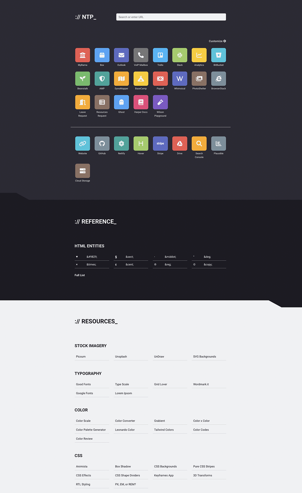

# New Tab Page

This is my personal new tab page extension for Firefox! I wanted a way to have more control over the content on the new tab page, including creating sections of links and quick reference.



## Usage

This will only work in [Firefox Developer Edition](https://www.mozilla.org/en-US/firefox/developer/) (until I can figure out how to [sign](https://extensionworkshop.com/documentation/publish/signing-and-distribution-overview/#signing-your-addons) the stupid thing).

1. Clone the repo and open "about:debugging" in Firefox Developer Edition.
2. Then select "load temporary addon" and navigate to manifest.json in this directory to load it.
3. You'll need to repeat this process each time you restart Firefox until I publish a proper signed release.

## Customization

You can customize the icons displayed in the top section by going to the customization page. Here you can add a new rule for each link you want to customize.

| Field    | Description                                                            | Default    |
| -------- | ---------------------------------------------------------------------- | ---------- |
| Case     | This should match the bookmark's name and is case sensitive            | N/A        |
| Color    | This selects the bookmark icon's background color                      | `slate`    |
| Icon Set | This selects the font awesome icon set to use                          | `fa-solid` |
| Icon     | This should be a font awesome icon class that matches the desired icon | `fa-link`  |

Please refer to [font awesome](https://fontawesome.com/search?m=free) for a list of all available icons and class names. This extension currently only supports free icons in the "solid" and "brands" icon sets.

Customization data is stored as a JSON object in the browser's local storage. This *should* be a stable enough place to store the data unless you manually clear site data when clearing things like cache and browsing history. I've exposed the JSON in a text area at the bottom of the options page. You can use this to copy and paste bulk preferences. This can be useful for creating backups of your customizations or even sharing customizations with others.

## Updating the addon

The extension uses the [bookmarks API](https://developer.mozilla.org/en-US/docs/Mozilla/Add-ons/WebExtensions/API/bookmarks), so new links can be added by adding bookmarks to the correct folders in bookmark manager.

The bookmarks should be organized in this folder structure using the Bookmark Manager:

```txt
All Bookmarks
└── Bookmarks Menu
    ├── NTP Links
    │   ├── Section
    │   └── Section
    └── Library
        ├── Section
        └── Section
```

The top area of the new tab page will create a new section for each folder inside the one named "NTP Links". Each section will display all bookmarks inside those child folders.

> **NOTE** that these sub folders are currently required. I plan to modify the script in the future to display links at the root of "NTP Links" at the very top so that the child folders are no longer necessary. This will help people who do not wish to have multiple sections in the top area.

The middle section is currently hard coded. I will be adding more to this area as needed for my own preference. I'm not sure how to open that area up for end user customization since I designed it to accept an arbitrary amount of content as needed. If you would like to modify this section, please make a fork of this project and customize it as desired. One day I may find a way to solve this in a reliable and secure way.

The bottom section will create sections for every child folder in the one named "Library" and can be used to list bookmarks under a given topic or group. For example, you may want to create a section for a reading list and another for inspiration. The titles for each section is copied directly from the name of the bookmark folder the section is generated from.

> **NOTE** that the "Library" folder requires sub folders to display links in that area. Also note that the folders "NTP Links" and "Library" are REQUIRED for the extension to work. I'll consider adding error handling in the future to make the extension a little more resilient.

## Disclaimer

I made this primarily for myself, tailored to my needs and preferences, so I don't really intend to release this as a plugin that I'd ever expect anyone but me to use. In fact, I never really planned to make it open source at all.

It was a challenging project and finding documentation for a lot of the functionality here was not easy or was overly complicated. I decided to make this code public and continue to expand on what it can handle so that others who are interested in developing something like this could look through my code for inspiration. Its also just a really cool project I wanted to show some friends :)

Hope someone out there also thinks this project is cool and that my humble code helps someone trying to solve similar problems. Feel free to fork this and use as a starting point to really make your own.

Thanks!

## Notes

### Content origin policy

This had to be adjusted to allow resources to be loaded from an external CDN (FontAwesome in this case). Doing so was not completely straightforward, so here are some useful links to explain that if ever needed in the future:

- [High level overview of CSP](https://developer.mozilla.org/en-US/docs/Web/HTTP/CSP)
- [CSP with web extensions](https://developer.mozilla.org/en-US/docs/Mozilla/Add-ons/WebExtensions/Content_Security_Policy)
- [Updating the manifest CSP](https://developer.mozilla.org/en-US/docs/Mozilla/Add-ons/WebExtensions/manifest.json/content_security_policy)
- [script-src](https://developer.mozilla.org/en-US/docs/Web/HTTP/Headers/Content-Security-Policy/script-src)
